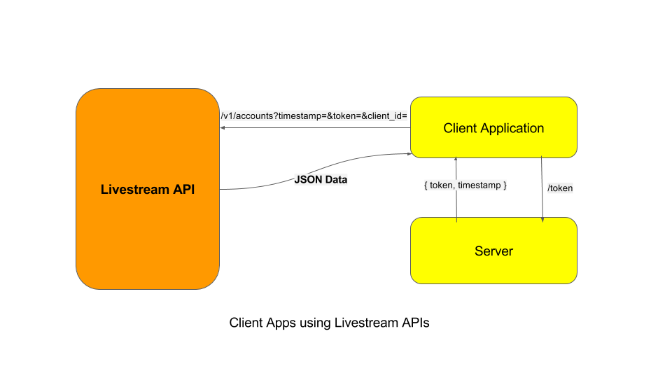

### Example of Angular Application making Livestream Rest API calls

### Prerequisite
- Install `node`

### Run your server & client app on same port

1. `cd api-keys-auth-sample/`
2. edit `[YOUR_API_KEY]` with your secret key in `server.js`
3. edit `[YOUR_CLIENT_ID]` with your client id in `client_application/app.js`
4. edit `SCOPE` with your desired scope ('readonly','playback',or 'all') in `server.js`
4. run `npm install`
5. start server `node server.js`
6. Open `http://localhost:8080/index.html` and you should see your account data. 

For more information please visit the documentation - https://livestream.com/developers/docs/api
